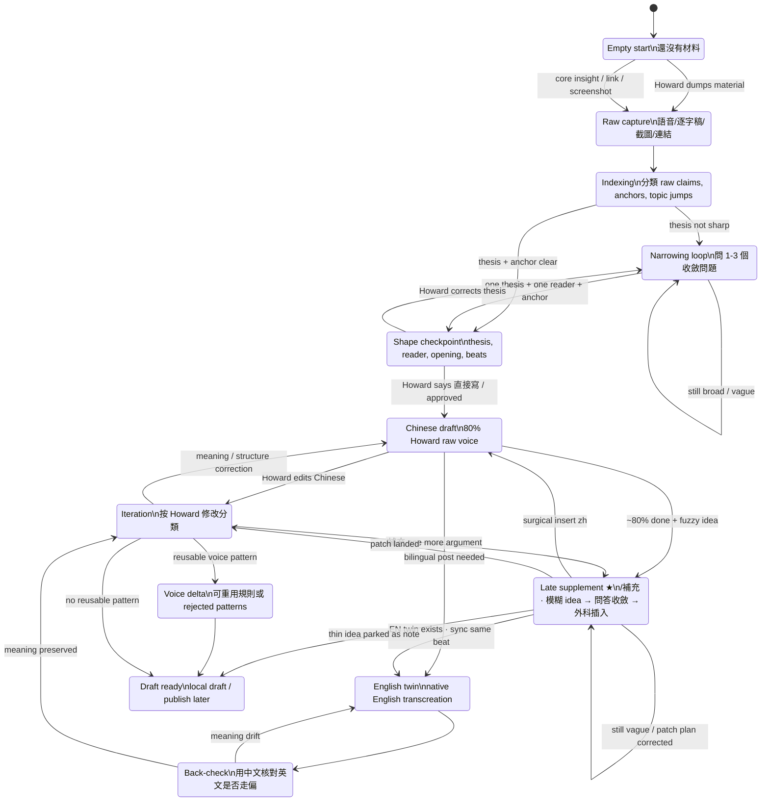
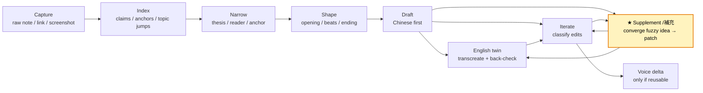

# howard-site

Howard 的個人網站。內容優先、agent-readable 優先。

這個 repo 的核心不是「做一個漂亮首頁」，而是把個人履歷、專案、文章、AI chat、`llms.txt`、RSS、sitemap、raw Markdown 都放在一個可被人和 agent 穩定讀取的地方。

## 快速開始

```bash
pnpm install
pnpm dev       # http://localhost:3000 — webpack, no source maps, heap cap 512MB
pnpm dev:turbo # Turbopack (Next default). DO NOT use if RAM is tight — has ballooned to 18GB+
pnpm dev:clean # wipe .next then pnpm dev
pnpm preview   # build + start (no HMR; lightest for reading drafts)
pnpm build     # production build, includes GitHub activity generation
pnpm lint
```

## 技術棧

- Next.js 16 App Router + TypeScript
- React 19
- Tailwind CSS v4, styles in `app/globals.css`
- Geist Sans / Geist Mono via `geist`
- MDX posts via `next-mdx-remote/rsc` + `gray-matter`
- Code highlighting via `rehype-pretty-code`
- Theme switching via `next-themes`
- No database. Static-friendly, Vercel-friendly.

## 內容入口

| 要改什麼 | 改哪裡 |
|---|---|
| 個人名字、bio、email、社群連結、專案 | `lib/config.ts` |
| 文章 | `posts/<year>/<slug>.mdx` |
| 文章圖片 | `public/posts/<slug>/...`（優先 WebP；長緩存見 `next.config.ts`） |
| 圖片/影片來源草稿（不部署） | `content/media-src/` |
| 效能 / DNS 備註 | `docs/context/performance.md` |
| 寫作 voice | `content/writing-voice.md` |
| 寫作流程 / `/write-blog` / `/補充` 規則 | `content/writing-process.md` |
| 公開 chat persona | `content/persona/*.md` |
| 導覽列 | `components/header.tsx` |
| 頁尾 | `components/footer.tsx` |
| 全站樣式 token | `app/globals.css` |

注意：`content/persona/` 會被餵進網站的 chat system prompt，等同公開資料。不要放私密內容。

私密寫作記憶放這裡，並且會被 gitignore：

```txt
content/writing-memory/*.private.md
```

## 文章格式

新增文章：

```txt
posts/2026/my-post.mdx
posts/2026/my-post.en.mdx   # optional English twin
```

基本 frontmatter：

```mdx
---
title: "文章標題"
description: "一句話摘要，會用在 RSS / llms.txt / meta"
date: "2026-07-01"
tags: ["web"]
draft: true
source_url: "https://howard-peng.xyz/2026/my-post"
captured_at: "2026-07-01"
lang: "zh"
---

正文從這裡開始。
```

規則：

- `draft: true` 是預設安全狀態。本機可看，Vercel production 不會露出。
- 發布時把 `draft: true` 改成 `draft: false` 或移除。
- 中文主檔用 `posts/<year>/<slug>.mdx`。
- 英文版本用 `posts/<year>/<slug>.en.mdx`。
- 圖片用 Markdown：``。
- 新文章會自動進首頁、RSS、sitemap、`llms.txt`，並有 `/<year>/<slug>.md` raw Markdown 版本。

## 寫作流程

這段是給自己和 coding agent 看的。實際規則以 `content/writing-process.md` 和 `content/writing-voice.md` 為準。

核心原則：

- 對話和語音逐字稿是 primary source，不是一次性 chat context。
- 中文保留 Howard 的聲音：Howard raw voice 80%，LLM polish 20%。
- 英文保留 Howard 的意思：Howard meaning 80%，LLM native prose work 更高。
- published posts 只是校準，不一定是 voice authority，因為可能已有 AI polish。
- 不要在 thesis 還不清楚時直接 draft。

狀態機對應 `content/writing-process.md` 的 user flow（含 **§5b Late supplement / `/補充`**）：



### 不同狀態怎麼用 skill

不同編輯狀態下，不要用同一種 prompt。先判斷目前在「收材料、收斂、定稿形、寫稿、迭代、**收尾補充**」哪一段，再叫對應的 skill / agent 行為。



| 目前狀態 | 直接這樣叫 |
|---|---|
| 沒有材料 | `/write-blog` 或 `$howard-write-blog`，先問我要 raw note / 核心感悟 / link |
| 有一大段語音 | `$howard-write-blog 先 index 這段，不要寫稿` |
| 材料很多但很散 | `幫我分出 thesis candidates，哪些可寫、哪些該拆篇` |
| thesis 不夠尖 | `用 mentor mode 問我 1-3 個問題收斂` |
| 準備寫但怕方向錯 | `先回 thesis + opening + beats，不要 draft` |
| 要中文初稿 | `讀 writing-voice，寫中文初稿，保留我的口語節奏` |
| 要英文版本 | `做 English twin，不要直譯；寫完用中文 back-check` |
| 我已經改稿 | `分類我的修改：meaning / voice / evidence / structure / taste` |
| 草稿約 80%、突然想加一個模糊論點 | `/補充` 或 `/supplement`：先問答收斂，再外科手術式插入 |
| 想沉澱規則 | `整理 voice delta，只保留可重用規則和 rejected patterns` |

跨工具時的叫法：

- Codex：用 `$howard-write-blog`，並要求先讀 `content/writing-process.md`。
- Claude：用 `/write-blog`，它會讀 `.claude/skills/write-blog/SKILL.md`；收尾補論點用 `/補充`（`.claude/skills/supplement/SKILL.md`）。
- Grok：用 `/supplement` 或說「補充」；skill 在 `.grok/skills/supplement/SKILL.md`。
- 一般 coding agent：先讀 `AGENTS.md`，再讀 `content/writing-process.md` 和 `content/writing-voice.md`。
- 不確定狀態時：先要求 agent 回報「目前狀態 + 下一步」，不要直接 draft。

## Agent 規則

跨 coding agent 時，先看：

1. `AGENTS.md`
2. `content/writing-process.md`
3. `content/writing-voice.md`
4. `.claude/skills/write-blog/SKILL.md` if using Claude
5. `.claude/skills/supplement/SKILL.md` or `.grok/skills/supplement/SKILL.md` for late-stage `/補充`

Codex 全域 skill：

```txt
/Users/howard/.codex/skills/howard-write-blog/SKILL.md
```

可以用 `$howard-write-blog` 觸發。

## 路由

| Route | 用途 |
|---|---|
| `/` | Bio + writing index |
| `/about` | Full bio, links, projects |
| `/ask` | Howard AI chat |
| `/resume.md` | Public resume Markdown for agents |
| `/<year>/<slug>` | 文章頁 |
| `/<year>/<slug>.md` | 文章 raw Markdown，rewrite 到 `/raw/<year>/<slug>` |
| `/llms.txt` | Agent-readable index |
| `/llms-full.txt` | Full post corpus for agents |
| `/feed.xml` | RSS |
| `/sitemap.xml` | Sitemap |
| `/robots.txt` | Robots |
| `/projects` | 301 → `/about`（舊連結；請用 `/about`） |

## Build 行為

`pnpm build` 會先跑：

```bash
node scripts/github-activity.mjs
```

它會產生：

```txt
content/persona/github-activity.md
```

這個檔案是 build-time generated，已經 gitignored。它會進 chat persona，但不應手動編輯。

## 部署

主要部署目標是 Vercel。

```bash
pnpm build
git status
git add ...
git commit -m "..."
git push
```

Push 後 Vercel 自動部署。

正式網域改動時，檢查：

- `SITE.url` in `lib/config.ts`
- posts frontmatter 的 `source_url`
- RSS / sitemap / JSON-LD 是否指向正式網域

## 發布前檢查

- `pnpm lint`
- `pnpm build`
- 新文章是否仍是 `draft: true`
- 要發布的文章是否已改成 `draft: false`
- 中文和英文 twin 的 `date`、`tags`、`source_url` 是否一致
- 圖片是否在 `public/posts/<slug>/`
- 私密 raw transcript 是否沒有進 git
